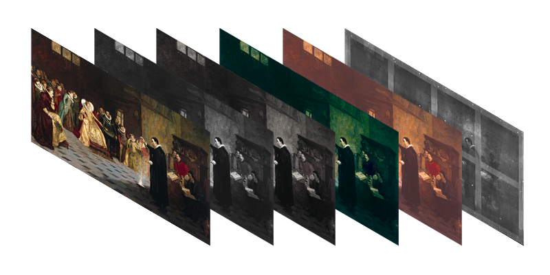
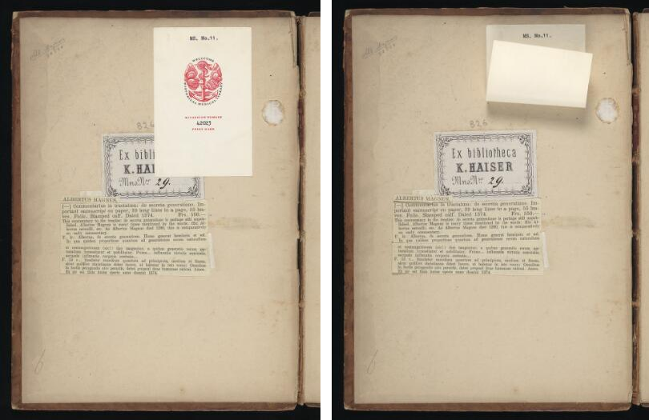

## Use Cases

There are multiple images available for a given view (Canvas). For example, a painting has been photographed using 10 different wavelengths of light. The images are _registered_ - that is, they all line up.

Another example would be a manuscript page with a flap or foldout; there are two registered images of the page available, one with the flap closed and one with it open. The page also has a transcription which is independent of either of these two images, because the annotations target the canvas.

_<small>Wellcome Library</small>_

In both cases the images are of the same thing. They each align (or could be aligned) with the same Canvas.

Users should be able to choose which of these images they want to view.

Client implementations should understand that the intent is to offer the user a **choice** between 2 or more images. The user can switch between them at will, but the publisher can expect that all clients will all start with the same image showing.

There are many potential user interface approaches for this model. For example, a tool used in the study of art conservation may have more sophisticated layer-blending features or other manipulations of the images.

This pattern is important because it is not uncommon, especially for artworks and for early manuscripts, to have more than one image available for the same view.

This recipe should not be used if the images make up multiple parts of the scene, where the intention is to display them together. For example, a digital reconstruction of parts of a manuscript page. In that scenario the intent is not to offer the user a choice of alternative views of the same thing, it is to build an overall view from multiple source images. This scenario is covered by the recipe [Composition of one view from multiple image sources][0036].  

## Implementation notes

The implementation builds on the [Support Deep Viewing with Basic Use of a IIIF Image Service][0005] recipe, except that the body of the annotation isn't an image resource directly, but a resource of type `choice`. This is defined in the W3C Web Annotation Data Model:

> "A 'Choice' has an ordered list of resources from which an application should select only one to process or display. The order is given from the most preferable to least preferable, according to the Annotation's creator or publisher." *— from [Choice Between Bodies](https://www.w3.org/TR/annotation-model/#choice-between-bodies)*

The multiple images are now values of the `choice` body, and each image resource should have a label property with at least one entry to convey information about each choice to the user.

If there is a Choice of content resource for the same Canvas, then they should each have at least the label property with at least one entry.

The presentation of images is upwards in a z-index from the first painting annotation encountered for all subsequent painting annotations.

This pattern may be used in conjunction with [Composition of one view from multiple image sources][0036]. A Canvas could have multiple sources composing the scene, one or more of which might be choices.

## Restrictions

Publishers should consider target viewing environments and clients when providing complex views of this nature.

Not all IIIF clients will recognize Choice. A very simple thumbnail strip viewer, for example, would not be able to offer a user interface for the required human choice (but should still just show the first image).

Clients need to consider generalized handling of multiple choices and multiple resources.
Clients that don't wish to offer a Choice UI should at least understand the construction and just take the first.

## Example

In this example, we have a single Canvas with the `body.type` "Choice" containing two different photographs of the same painting: one using natural light and the other an x-ray image.

*Note: Currently, Mirador 3 only partially supports the layering of multiple images on a single Canvas. While previous iterations of Mirador processed the images upwards from the first painting annotation, Mirador 3 does this in reverse. This means that the first image in the "choice" body sits at the top of the "stack" in Mirador 3 rather than at the bottom.*

Credit: *John Dee performing an experiment before Queen Elizabeth I*. Oil painting by Henry Gillard Glindoni. Credit: Wellcome Collection. Attribution-NonCommercial 4.0 International (CC BY-NC 4.0)





## Related recipes

* [Foldouts, Flaps, and Maps][0035]
* [Composition of one view from multiple image sources][0036]



