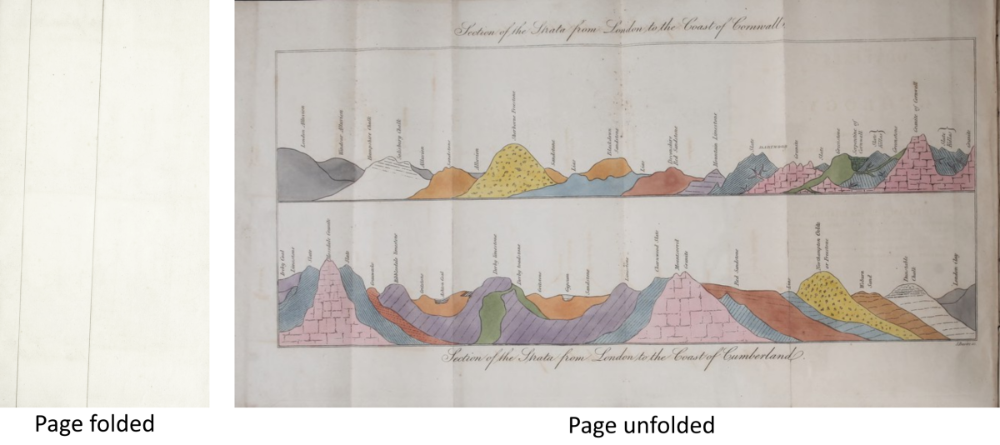

## Use Case

Books (and other objects) sometimes include foldout flaps or sheets, such as a map in a historical work. During digitization, the foldout might be captured in both its folded and unfolded state.

In the previous example, [Choice](../0033-choice/), a flap is offered to users as a `Choice` of images for the same view. But consider this example:



Here, the page has been captured folded and unfolded. Unlike the previous example, these are not the same **view**. There is no one single IIIF `Canvas` that would serve to represent both of these spatial extents - we can't logically place these two images on the same spatial view. 

While the present example and that given in [Choice](../0033-choice/) are clearly different, the modelling decision may not always be as obvious. There will be cases that could be modelled in either way, depending on what the publisher is trying to present.


## Implementation notes

The unfolded view is simply an additional canvas in the sequence given by `manifest.items`.

These pages are from a printed, paged book, which might have the `behavior` value of `paged`, so as to generate the correct recto-verso-recto-verso representation in a viewer that supports that behavior. If we insert an additional canvas into the manifest's `items`, we will break this sequence unless we introduce an additional `behavior` on the foldout, to indicate that it is not part of the paged sequence.


## Example

This example has been adapted from [https://wellcomelibrary.org/iiif/b29346423/manifest](https://wellcomelibrary.org/iiif/b29346423/manifest) but in a much reduced form to convey the essential points.

The manifest is given the behavior `paged`. With no other qualifiers, this indicates a left-to-right sequence with the first item _recto_.

The sequence is:

* Front cover
* Inside front cover
* Foldout, folded
* Foldout, unfolded (given the behavior `non-paged`, to indicate that it does not constitute part of the paged sequence of the manifest)
* Title page
* _the normal run of pages would continue here; removed in this manifest for brevity_
* Back of title page
* Inside back cover
* Back Cover

[JSON-LD](manifest.json)

{: .line-numbers data-download-link data-download-link-label="Download me" data-src="manifest.json" }
```json
```


# Related recipes

The following recipes are all about multiple image use cases, with different modelling approaches:

* [Choice](../0033-choice/). Here the choice of images are within the same view, rather than two separate views as above.





