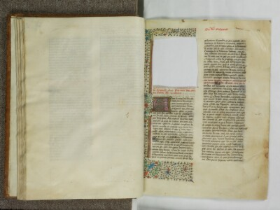
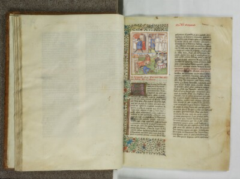

## Use Case

This recipe should be considered alongside [Choice with Image Services](../0034-choice-with-image-services/) and [Foldouts](../0035-foldouts/). They each involve multiple images that are in some way associated with the same part of an object, but the different modeling approaches have different purposes and should generate different user interface options in a client application.

This recipe is about composition of a single view from multiple content resources, such as multiple images, time based media or combinations of media formats. The motivation of the content annotation is `painting`, but here there are multiple resources to be painted onto the Canvas together.

Whereas the example in [Choice with Image Services](../0034-choice-with-image-services/) is about offering alternative content resources for the same view, the current recipe is not about offering a choice to the user. It might not make sense to offer the user any control over which of the content resources built up on the canvas are visible; the intent of the publisher is to say that all these resources make up the scene, assembled on the Canvas in the order provided.

Consider a Canvas with a duration, that contains images, video and audio that are shown in various parts of the scene at different points along the timeline. While control of visibility may be useful in a sophisticated IIIF client, it is not the publisher's intent to offer this control but instead to build the scene from separate content resources.

Another IIIF example is the digital recombination of manuscripts. At the page-by-page level this is achieved by assembling a manifest that references Canvases from different institutions, or minting new Canvases that each separately reference an image.

Digital recombination can also happen **within** a Canvas, as in the familiar Châteauroux example. We have the manuscript page, missing its illumination:

And the illumination itself:

We want to produce a combined view from these two sources:

With multiple images on a Canvas, the model is saying that all this content belongs on the Canvas. It is opinionated about order, which matters for resources that target spatial extents of the Canvas (images and video) that might overlap each other. The resource are assembled _upwards_ on the canvas in the order they are provided in the Manifest. This works like Z-index in CSS.

## Multiple painted resources vs Choice

This example could also be implemented as a `Choice` as in the [Choice recipe](../0033-choice/). However, that would impose a requirement on the client (a viewer) to offer user interface to make that choice. The simplest client would just assemble the scene from the resources provided with no decisions or additional interactions required on the part of the user.

In this example there is benefit to being able to view the two image resources independently, and a sophisticated client could still offer that choice to the user though enhanced layer controls, even though the resources are provided as the composite parts of the scene.

The viewer implementation should by default assemble and display all the content provided on the Canvas, in the right place(s) and at the right time(s). For many Canvases, especially those involving time-based media, any implementation that isn't a completely deterministic rendering of the provided content would be counter to the publisher's intent or require the client to have more knowledge of that intent than is possible.

## Implementation notes

The presentation of images is upwards in a z-index from the first painting annotation encountered for all subsequent painting annotations. Thus the small 300 pixel square image is painted on top of the larger 1800x1200 image in the first annotation, rather than the other way around.

## Example

A manifest with a single canvas that has two images painted on it. One is of the entire object, and one fills in a missing detail from the first image.





# Related recipes

* [Choice](../0033-choice/). The Châteauroux example above could also be modelled as a Choice, if the intent is to offer the user control of which resources are visisble.
* [Foldouts](../0035-foldouts/). In the Châteauroux example shown in the pictures on this page, the two images are aligned to the same Canvas. For a large map that folds out to a much bigger view, the unfolded version would be a different Canvas, because it does not represent the same spatial view.
