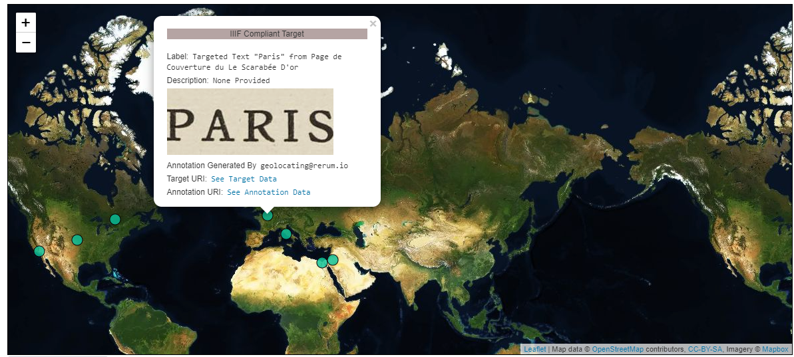
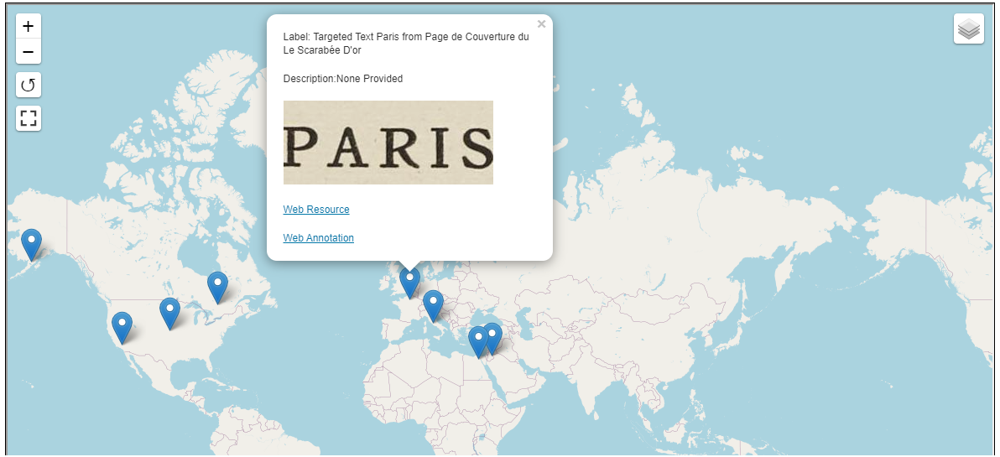

### Use Case 
There is a region of interest on a Canvas that could be further described by geocoordinates. The region contains the word "Paris", and so the geocoordinates should be of a central point in Paris, France.  You want the Canvas to contain geocoordinates that clients can use for representing the targeted fragment in world map based user interfaces, such as [Leaflet](https://leafletjs.com/examples/geojson/) or [Google Maps](https://developers.google.com/maps/documentation/javascript/importing_data).  This could mean simply displaying a geometric shape on a map and may or include more data to allow for interaction with the displayed shapes.

### Implementation Notes
The third party [GeoJSON-LD](https://geojson.org/geojson-ld/) context is included alongside the IIIF Presentation 3 context. This supplies the vocabulary terms for the GeoJSON-LD Annotation bodies since the IIIF Presentation 3 context does not describe those terms. The field `@context` can be an array, and when it is the IIIF Presentation API 3.0 context must be the last item in the array. 

GeoJSON `properties` is a generic field and [can be nearly anything](https://tools.ietf.org/html/rfc7946#section-3.2). If, for example, the targeted resource has a `label` and the `properties` field contains a `label`, the consuming interface must make a choice on which to prioritize for presentation purposes.

Note that [`geometry` can be more than just a `Point`.](https://tools.ietf.org/html/rfc7946#section-3.1)

### Restrictions
Applications that strictly follow Linked Data practices will find that nested GeoJSON coordinate arrays are incompatible with the processing model of JSON-LD 1.0. The JSON-LD 1.1 processing model does not have this restriction. Be aware if you plan to serialize JSON-LD into [other semantic data formats or markup languages](https://www.w3.org/TR/json-ld11/#relationship-to-other-linked-data-formats) such as RDF.  

### Example
An example of a Manifest that has a Canvas fragment geolocated to a geographic point. The Manifest contains one Canvas with one Image, and the Canvas has the same size dimensions as the Image. The Canvas contains one Annotation Page with one Annotation targeting the region of interest where "Paris" appears using the [#xywh Fragment Selector syntax](https://www.w3.org/TR/annotation-model/#fragment-selector).  The Annotation body is GeoJSON-LD which is supported by a number of open source mapping systems. A client can parse out the Annotation from the Canvas and pass the Annotation body into MapUI systems as GeoJSON resulting in rendered geometric shapes on a world map. Often, data from the resource such as an image URL, label or description is connected with those shapes via [`properties`](https://tools.ietf.org/html/rfc7946#section-3.2) in GeoJSON. Since the image used is a IIIF Fixture following [IIIF Image API 3.0](https://iiif.io/api/image/3.0/), you can see the targeted fragment by supplying [the values used in the #xywh selector to the image URL](https://iiif.io/api/image/3.0/example/reference/59d09e6773341f28ea166e9f3c1e674f-gallica_ark_12148_bpt6k1526005v_f20/1300,3370,250,100/max/0/default.jpg).  





### Leaflet Example

### MapML Example

## Related Recipes
* [Geolocate Canvas Fragment to Multiple Points][TBD]
* [Geolocate Manifest to a Point][TBD]
* [Geolocate Manifest to a Polygonal Area][TBD]
* [Fragment Selectors][0020]
* [Tagging Annotation][0021]



