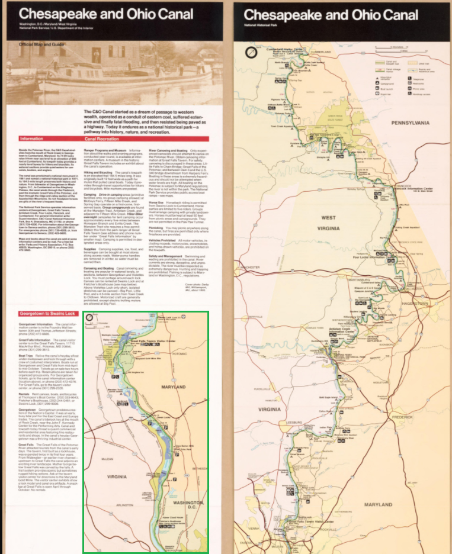
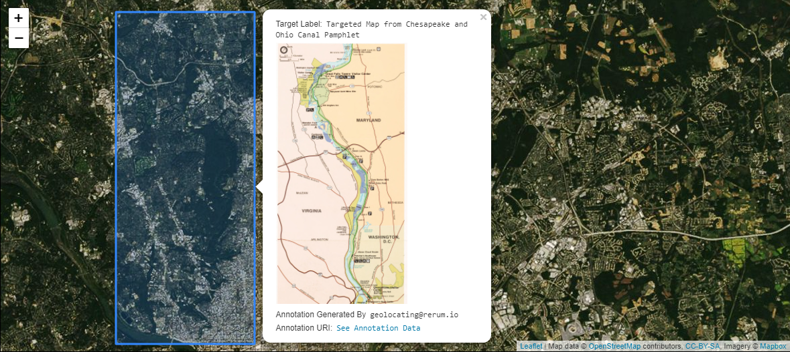

A multitude of real world resources benefit from geographic data, many of which are already represented in IIIF digital collections. New and old maps, travel journals, newspapers, manuscripts, poems and diaries are just a subset of cultural heritage artifacts that have geographic characteristics. These traits bring human context to the material and offer a recognizable, comfortable setting for discovering connections between disparate resources.

### Use Case 
A Canvas has a region of interest that contains a map. You would like to associate this map with geographic coordinates for use in web mapping clients like [Leaflet](https://leafletjs.com/examples/geojson/) and [OpenLayers](https://openlayers.org/en/latest/examples/geojson.html). This could mean simply showing a non-interactive shape on a web map, but often more data from the resource is displayed in connection with the shape as a result of available functionality. The example below shows a pop-up that appears upon clicking the shape. The pop-up includes the targeted map as well as other metadata from the resource.

	
	

### Implementation Notes
The third party [GeoJSON-LD](https://geojson.org/geojson-ld/) context is included in addition to the IIIF Presentation API 3.0 context. The GeoJSON-LD context supplies the vocabulary terms for the Annotation bodies since the IIIF Presentation API 3.0 context does not describe those terms. When there are multiple contexts, the `@context` property can be an array which is processed as a set. Typically order does not matter for a set. However, when the IIIF context is used in these arrays it must be the last item in the set.

The GeoJSON `properties` object is generic and [can be nearly anything](https://tools.ietf.org/html/rfc7946#section-3.2). It is used to pass metadata along with the geocoordinates. This has implications on clients and parsers that must discern what data to use. For example, if the targeted resource has a `label` property and the `properties` object has a `label` property, the consuming interface must make a choice on which to prioritize for presentation purposes. In the image from the Use Case section, the "Label" uses the GeoJSON `properties` object's `label` property (lines 80-83) instead of the `label` property from the Annotation or Canvas. This is because web mapping clients are designed to look for metadata in GeoJSON `properties` for display.

Note that [`geometry` has more types besides `Polygon`.](https://tools.ietf.org/html/rfc7946#section-3.1)

### Restrictions
Applications that strictly follow Linked Data practices will find that nested GeoJSON coordinate arrays are incompatible with the processing model of JSON-LD 1.0. The JSON-LD 1.1 processing model does not have this restriction. Be aware if you plan to serialize JSON-LD into [other semantic data formats or markup languages](https://www.w3.org/TR/json-ld11/#relationship-to-other-linked-data-formats) such as RDF.  

### Example
The Manifest has one Canvas with one Image, and the Canvas has the same size dimensions as the Image. The Canvas has one Annotation Page with one Annotation targeting the region of interest where a map depiction appears using the [#xywh Fragment Selector syntax](https://www.w3.org/TR/annotation-model/#fragment-selector). The Annotation `body` is GeoJSON-LD, which is supported by a number of open source mapping systems. A client can parse the Annotation from the Canvas and pass the Annotation `body` into a web map resulting in rendered geometric shapes on a world map. Often, data from the resource such as an image URL, label, or description is connected with those shapes via [`properties`](https://tools.ietf.org/html/rfc7946#section-3.2) in GeoJSON. Since the image used is a IIIF Fixture following [IIIF Image API 3.0](https://iiif.io/api/image/3.0/), you can see the targeted fragment by supplying [the values used in the #xywh selector to the image URL](https://iiif.io/api/image/3.0/example/reference/43153e2ec7531f14dd1c9b2fc401678a-88695674/920,3600,1510,3000/max/0/default.jpg).   





## Related Recipes
* [Fragment Selectors][0020]
* [Tagging Annotation][0021]




	<h4 style="color:white;"> Click Image to Close </h4>
	

