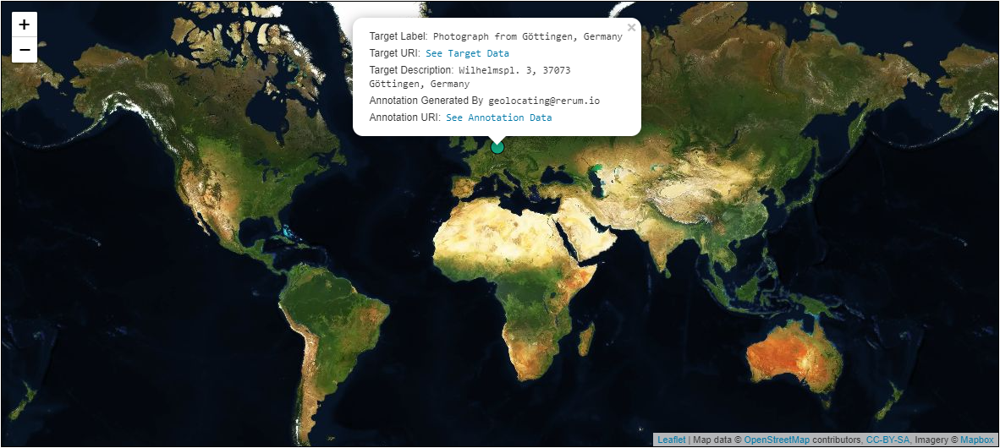

### Use Case 
A Manifest contains a single Canvas item representing a photograph. Using the navPlace extension, I can specify a geographic location for the image that a web-based map platform can display. This location can refer to where the image is currently located, the origin of the object, or any other location attribute. In the example below, the location for the image shows its origin in X rather than its current location in Y. 

### Implementation Notes
Please refer to the [implementation notes for navPlace.](https://iiif.io/api/extension/navplace/#5-implementation-notes) 

### Example
The Manifest below contains one Canvas with a photograph painted onto it. The Manifest contains the `navPlace` property which stores geographic information ascertained from the photograph. `navPlace` contains GeoJSON-LD, which is supported by a number of open source mapping systems. A client can parse GeoJSON features from `navPlace` and pass the features into a web map resulting in rendered geometric shapes on a world map. Often, data from the resource such as an image URL, label or description is connected with those shapes via [`properties`](https://tools.ietf.org/html/rfc7946#section-3.2) in GeoJSON.  Web maps typically offer built in display functionality for metadata contained in `properties`.





## Related Recipes
* [Represent Canvas Fragment as a Geographic Area in a Web Mapping Client][0139]
* [Provide Geographic Coordinates for Canvases in a Manifest with navPlace][0240]




	<h4 style="color:white;"> Click Image to Close </h4>
	

