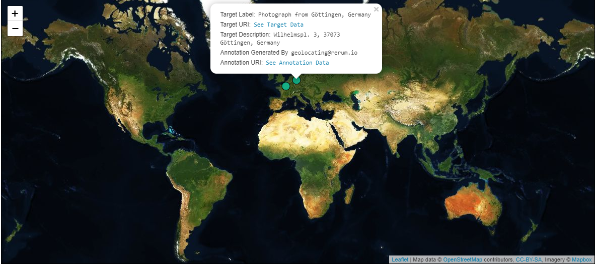

### Use Case 
A Manifest contains Canvas items which represent photographs taken at places of significance. You would like to associate each Canvas with geographic coordinates for use in web mapping clients like Leaflet and OpenLayers. You intend for each Canvas to be represented in a web map so that the web map will work as a Canvas browser. This could mean simply showing non-interactive shapes on a web map, but often more data from the resources is displayed in connection with the shapes as a result of available functionality. The example below shows a pop-up that appears upon clicking the shape. 

	<h4 style="color:white;"> Click Image to Close </h4>
	

### Implementation Notes
IIIF has a registered API extension called `navPlace` which is used to associate geographic coordinates with IIIF resource types, and it is leveraged here to meet the use case. You will notice multiple contexts used in the top level `@context` property. The navPlace extension has its own linked data context which is included prior to the IIIF Presentation API 3.0 context. It is important to note that the [GeoJSON-LD](https://geojson.org/geojson-ld/) context is scoped into the navPlace linked data context. Combined, these contexts suppliy the vocabulary terms for the GeoJSON-LD used in the value for `navPlace` as well as the `navPlace` term itself. When there are multiple contexts, the `@context` property can be an array which is processed as a set. Typically order does not matter for a set. However, when the IIIF context is used in these arrays it must be the last item in the set.

GeoJSON `properties` is a generic field and [can be nearly anything](https://tools.ietf.org/html/rfc7946#section-3.2). If, for example, the targeted resource has a `label` and the `properties` field contains a `label`, the consuming interface must make a choice on which to prioritize for presentation purposes. In the example renderings, the label inside `properties` is used as opposed to the label from the Manifest or Canvas.  

Note that [`geometry` has more types besides `Point`.](https://tools.ietf.org/html/rfc7946#section-3.1)

### Restrictions
Applications that strictly follow Linked Data practices will find that nested GeoJSON coordinate arrays are incompatible with the processing model of JSON-LD 1.0. The JSON-LD 1.1 processing model does not have this restriction. Be aware if you plan to serialize JSON-LD into [other semantic data formats or markup languages](https://www.w3.org/TR/json-ld11/#relationship-to-other-linked-data-formats) such as RDF.

### Example
The Manifest below contains two Canvases. Each Canvas has one Image with a photograph painted onto it. Those Canvases also contain the `navPlace` property which stores geographic information about the photograph. `navPlace` contains GeoJSON-LD, which is supported by a number of open source mapping systems. A client can parse `navPlace` from a Canvas and pass the GeoJSON into a web map resulting in rendered geometric shapes on a world map. Often, data from the resource such as an image URL, label or description is connected with those shapes via [`properties`](https://tools.ietf.org/html/rfc7946#section-3.2) in GeoJSON.





## Related Recipes
* [Represent Canvas Fragment as a Geographic Area in a Web Mapping Client][0139]
* [Provide Geographic Coordinates for a Manifest with navPlace][0154]




