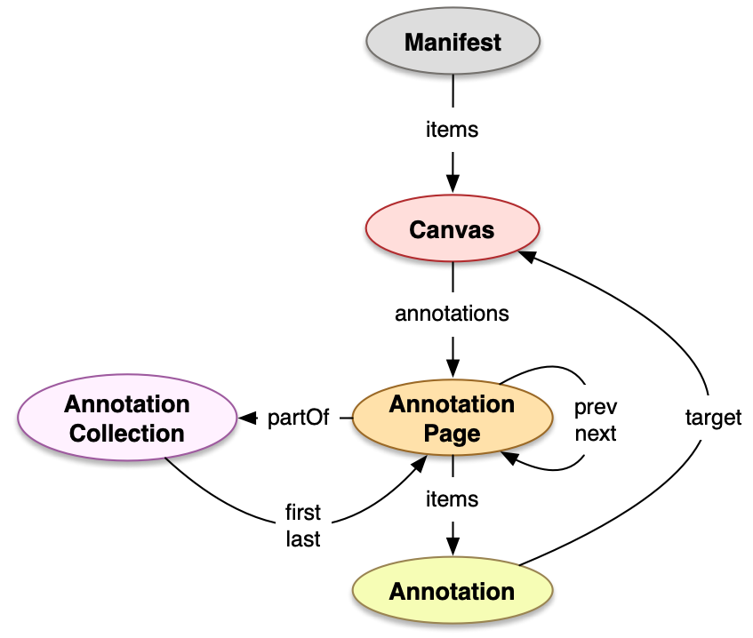

## Use Case

You have a large number of Annotations covering multiple Canvases in a Manifest, for example crowd-sourced transcriptions or the output from a layout analysis algorithm, and you want the Annotations to be displayed in a viewer as a recognizable group over the document with a label and possibly a common color.

## Implementation Notes

The [IIIF Presentation API 3](https://iiif.io/api/presentation/3.0/#58-annotation-collection) defines Annotation Collections as a mechanism to represent groupings of Annotation Pages that should be managed as a single whole, regardless of which Canvas or resource they target. A viewer could, for example present all Annotations belonging to a Collection with a common color but the choice of presentation is left to the viewer.

The Annotation Collection is a separate document that references a chain of one or more separate Annotation Pages which contain the Annotations. The Annotation Pages contain a reference to the parent Annotation Collection and a reference to the next page in the chain.

The Annotation Collection must have a `type` of "AnnotationCollection" and should have a `label` property that can be shown to the user and it can optionally contain additional properties as specified in the [IIIF Presentation API 3](https://iiif.io/api/presentation/3.0/#a-summary-of-property-requirements). 

The Annotation Collection has a `first` property that contains the URI of the first Annotation Page in the sequence, a `last` property that contains the URI of the last Annotation Page and it should have a `total` property that contains the total number of Annotations in the collection.

The IIIF Manifest requires that Annotations that are intended to be shown on a Canvas are contained in Annotation Pages referenced in the `annotations` property of that Canvas. This means that all Annotations need to be grouped by Canvas and put into one or more Annotation Pages per Canvas. An Annotation Page can not contain Annotations for more than one Canvas.

   

The Annotation Pages must have a `type` of "AnnotationPage" and have an `items` property containing the list of Annotations, a `partOf` property that contains the URI of the parent Annotation Collection, and `next` and `prev` properties that contain the URIs of the next and previous Annotation Pages in the sequence. Annotation Pages are often separate documents that are [referenced][0269] in the Manifest using a reference object with an `id` property containing the URI of the external document and `type` containing its type. The reference object can also provide copies of other properties from the external document for access inside the Manifest.

For an Annotation Page you can provide the `partOf`, `next`, `prev` property in the reference object in the `annotations` property of the Canvas. In the `partOf` property of the Annotation Page you can provide a reference object for the Annotation Collection and its `label`, `total`, `first`, and `last` properties as in the example below. In the case of the Annotation Collection it is strongly suggested that you provide these properties in the Manifest to make it possible for the IIIF viewer to know that the Annotations are part of a Collection and display its label without having to load any of the external documents. If the information is not in the Manifest the viewer has to load all Annotation Pages referenced in the Canvases to find and load the Annotation Collections.

## Example

We use a Manifest containing two pages from a newspaper (_Berliner Tageblatt_, February 16, 1925, from Staatsbibliothek Berlin via Europeana) and a set of Annotations concerning layout and reading order.

The Annotations select rectangular regions on the Canvases in the Manifest and add textual tags describing layout elements. They are contained in two AnnotationPages "anno_p1.json" for Annotations on the first Canvas and "anno_p2.json" for Annotations on the second Canvas. "anno_p1.json" contains a `next` reference to "anno_p2.json", "anno_p2.json" contains a `prev` reference to "anno_p1.json", and both pages contain a `partOf` reference to the AnnotationCollection.

The Annotation Collection is in the file "anno_coll.json". It has a `label` and references "anno_p1.json" as the `first` and "anno_p2.json" as the `last` page and contains the `total` number of Annotations.

The Annotation Collection referencing the Annotation Pages:



The first AnnotationPage with Annotations on the first Canvas: [anno_p1.json](anno_p1.json)

The second AnnotationPage with Annotations on the second Canvas: [anno_p2.json](anno_p2.json)

The Manifest containing the two Canvases and referencing the Annotation Pages:





## Related Recipes

* [Embedded or Referenced Annotations][0269] for referencing Annotations in external Annotation Pages
* [Simple Annotation - Tagging][0021] annotating a rectangular Canvas region



