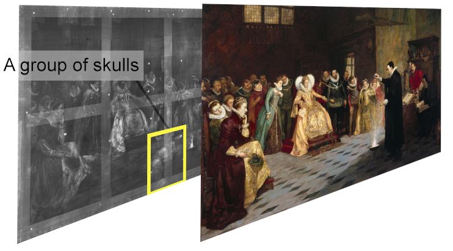

## Use Case
An annotation might be specific to a single image or a part of an image rather than
the whole canvas. For instance, you might want to annotate a detail of a painting
which is visible only on a specific image corresponding to a band of a multi-spectral
acquisition stack. 

If you are analyzing a complex multi-layer image you might want to keep the annotations linked to a content resource (image, layer etc. etc.) together for facilitating the analysis or dereferencing the content resource while retaining its annotations.

## Implementation Notes
The [Web Annotation Model ](https://www.w3.org/TR/annotation-model/#introduction)
specify that:

> Typically, an Annotation has a single Body, which is a comment or other descriptive resource, and a single Target that the Body is somehow "about".

Other recipes like [0021-tagging](https://iiif.io/api/cookbook/recipe/0021-tagging/) or [0266-full-canvas-annotation](https://iiif.io/api/cookbook/recipe/0266-full-canvas-annotation/) add the annotation to the annotations list of the `canvas` targetting the `id` of the canvas itself. 
In this example, we will write the annotation as part of the `contentresources` associated with the canvas adding an `annotation page` with an `annotation` inside the `annotations` list of the 
`contentresources`. 

Another possibility could be to add the annotation in the `annotations` field of the `canvas`.

In both cases, to target a specific image (and not the whole canvas) the `target` of the annotation must be the `id` of the image. Although using the `id` of the service could be semantically correct, this usage is discouraged for the possible added complexity in the visualization process.

For annotating a part of the image we use the [media fragment selector](https://www.w3.org/TR/annotation-model/#fragment-selector) (e.g. `#xywh=50,50,640,480`) that is concatenated after the target string.

Some visualizers might choose to render only the annotation of the active content resource/layer or to allow to group the annotations based on the content resource they are targeting. 

## Restrictions
Currently no viewers are supporting this feature.

We might be tempted to apply the same pattern to images part of a composition like in the recipe [0036](https://iiif.io/api/cookbook/recipe/0036-composition-from-multiple-images/). However, it is likely that the viewers might not be able to render correctly the annotations, due to the complexity of referencing the annotation on a common coordinate reference system.   

## Example
The example is based on the recipe [Multiple Choice of Images in a Single View (Canvas)][0033]. In this case, we want to annotate the skulls on the floor that are visible only on the X-Ray image. We create an `annotation page` with an `annotation`. We want to tag only a portion of the image thus the motivation of the annotation must be `tagging` the `body` of the annotation must be `TextualBody` containing a text describing what we see in that portion of the X-Ray image, hence the format of the annotation must be `text/plain`. The target of the annotation will be the `id` of the image followed by the fragment containing the coordinates of the region of interest `#xywh=810,900,260,30`.

Credit: John Dee performing an experiment before Queen Elizabeth I. Oil painting by Henry Gillard Glindoni. Credit: Wellcome Collection. Attribution-NonCommercial 4.0 International (CC BY-NC 4.0)





## Related Recipes

* [Multiple Choice of Images in a Single View (Canvas)][0033] for the original example without annotations.
* [Simple Annotation — Tagging][0021] for an Annotation using a fragment selector
* [Full canvas annotation][0266] for a simple annotation of the whole canvas.
* [Annotation with a Non-Rectangular Polygon][0261] for an Annotation using an SVG selector
* [Simplest Manifest - Image][0001]
* [Composition from multiple images][0036] another approach for building multi-layer canvases 
* [Embedded or Referenced Annotations][0269]




