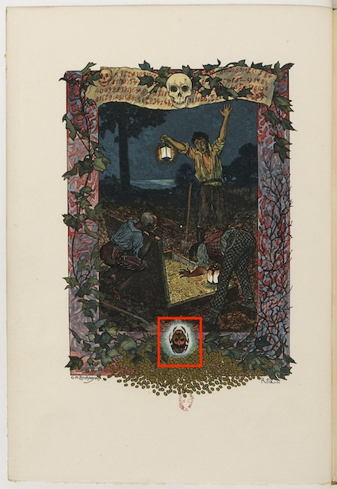

## Use Case

I want to share a link to highlight a detail in a specific region of an image to share a portion of a digitized manuscript text, allowing the user easy access to the rest of the manuscript.

Institutions might want to use this recipe to share portions of their object through social media, allowing a direct link to the viewer to improve the user's interaction with the digitized content. A scholar who finds a relevant passage in a manuscript might want to share the precise location with other colleagues, allowing them to check the original source.

## Implementation Notes

This request can be implemented in a standardized manner using the [IIIF Content State API](https://iiif.io/api/content-state), providing the data as values of the `iiif-content` query string parameter as explained in the [API section](https://iiif.io/api/content-state/1.0/#initialization-mechanisms-link).

We can use the [Web Annotation Data Model](https://www.w3.org/TR/annotation-model/) to encode the information necessary, as shown in ["A Region of a Canvas in a Manifest"](https://iiif.io/api/content-state/1.0/#51-a-region-of-a-canvas-in-a-manifest) section of the standard.

However, before passing the data as a query parameter, we must encode it as explained in the [Content State encoding guidelines](https://iiif.io/api/content-state/1.0/#6-content-state-encoding).

In this example, we want to highlight a portion of an image contained in a book.  We will use the following manifest shown in the Simple Manifest Book recipe, which is available at the following link: [https://iiif.io/api/cookbook/recipe/0009-book-1/manifest.json](https://iiif.io/api/cookbook/recipe/0009-book-1/manifest.json)

We want to open the viewport to a specific Canvas region using a viewer available on the following page `https://example.org/viewer`.

First, we create an Annotation:

```json
{
  "@context": "http://iiif.io/api/presentation/3/context.json",
  "id": "https://iiif.io/api/cookbook/recipe/0485-contentstate-canvas-region/annotation.json",
  "type": "Annotation",
  "motivation": ["contentState"],
  "target": {
     "id": "https://iiif.io/api/cookbook/recipe/0009-book-1/canvas/p2#xywh=1528,3024,344,408",
     "type": "Canvas",
     "partOf": [{
        "id": "https://iiif.io/api/cookbook/recipe/0009-book-1/manifest.json",
        "type": "Manifest"
 }]
 }
}
```

We can create an Annotation with `motivation` set to `contentState` and a target `type` set to Canvas. The `id` of the target will contain a fragment selector (`#xywh=1528,3024,344,408`) with the coordinates of the Canvas we want to share, while the `partOf` element has the `id` of the Manifest containing the Canvas.

We can now use one of the methods listed in the [examples of Content State encoding section](https://iiif.io/api/content-state/1.0/#63-examples-of-content-state-encoding) to generate a base64url string (**note: for brevity, we removed new line characters and white space before computing the base64url**).

We can pass the encoded value, using the `iiif-content` query parameter of the viewer landing page:
[https://example.org/viewer?iiif-content=JTdCJTBBJTIwJTIwJTIyJTQwY29udGV4dCUyMiUzQSUyMCUyMmh0dHAlM0ElMkYlMkZpaWlmLmlvJTJGYXBpJTJGcHJlc2VudGF0aW9uJTJGMyUyRmNvbnRleHQuanNvbiUyMiUyQyUwQSUyMCUyMCUyMmlkJTIyJTNBJTIwJTIyaHR0cHMlM0ElMkYlMkZpaWlmLmlvJTJGYXBpJTJGY29va2Jvb2slMkZyZWNpcGUlMkYwNDg1LWNvbnRlbnRzdGF0ZS1jYW52YXMtcmVnaW9uJTJGYW5ub3RhdGlvbi5qc29uJTIyJTJDJTBBJTIwJTIwJTIydHlwZSUyMiUzQSUyMCUyMkFubm90YXRpb24lMjIlMkMlMEElMjAlMjAlMjJtb3RpdmF0aW9uJTIyJTNBJTIwJTVCJTBBJTIwJTIwJTIwJTIwJTIyY29udGVudFN0YXRlJTIyJTBBJTIwJTIwJTVEJTJDJTBBJTIwJTIwJTIydGFyZ2V0JTIyJTNBJTIwJTdCJTBBJTIwJTIwJTIwJTIwJTIyaWQlMjIlM0ElMjAlMjJodHRwcyUzQSUyRiUyRmlpaWYuaW8lMkZhcGklMkZjb29rYm9vayUyRnJlY2lwZSUyRjAwMDktYm9vay0xJTJGY2FudmFzJTJGcDIlMjN4eXdoJTNEMTUyOCUyQzMwMjQlMkMzNDQlMkM0MDglMjIlMkMlMEElMjAlMjAlMjAlMjAlMjJ0eXBlJTIyJTNBJTIwJTIyQ2FudmFzJTIyJTJDJTBBJTIwJTIwJTIwJTIwJTIycGFydE9mJTIyJTNBJTIwJTVCJTBBJTIwJTIwJTIwJTIwJTIwJTIwJTdCJTBBJTIwJTIwJTIwJTIwJTIwJTIwJTIwJTIwJTIyaWQlMjIlM0ElMjAlMjJodHRwcyUzQSUyRiUyRmlpaWYuaW8lMkZhcGklMkZjb29rYm9vayUyRnJlY2lwZSUyRjAwMDktYm9vay0xJTJGbWFuaWZlc3QuanNvbiUyMiUyQyUwQSUyMCUyMCUyMCUyMCUyMCUyMCUyMCUyMCUyMnR5cGUlMjIlM0ElMjAlMjJNYW5pZmVzdCUyMiUwQSUyMCUyMCUyMCUyMCUyMCUyMCU3RCUwQSUyMCUyMCUyMCUyMCU1RCUwQSUyMCUyMCU3RCUwQSU3RA](https://example.org/)

We can also create an anchor tag with the link as the `href` attribute for use in a web page:

```html
<a href="https://example.org/viewer?iiif-content=JTdCJTBBJTIwJTIwJTIyJTQwY29udGV4dCUyMiUzQSUyMCUyMmh0dHAlM0ElMkYlMkZpaWlmLmlvJTJGYXBpJTJGcHJlc2VudGF0aW9uJTJGMyUyRmNvbnRleHQuanNvbiUyMiUyQyUwQSUyMCUyMCUyMmlkJTIyJTNBJTIwJTIyaHR0cHMlM0ElMkYlMkZpaWlmLmlvJTJGYXBpJTJGY29va2Jvb2slMkZyZWNpcGUlMkYwNDg1LWNvbnRlbnRzdGF0ZS1jYW52YXMtcmVnaW9uJTJGYW5ub3RhdGlvbi5qc29uJTIyJTJDJTBBJTIwJTIwJTIydHlwZSUyMiUzQSUyMCUyMkFubm90YXRpb24lMjIlMkMlMEElMjAlMjAlMjJtb3RpdmF0aW9uJTIyJTNBJTIwJTVCJTBBJTIwJTIwJTIwJTIwJTIyY29udGVudFN0YXRlJTIyJTBBJTIwJTIwJTVEJTJDJTBBJTIwJTIwJTIydGFyZ2V0JTIyJTNBJTIwJTdCJTBBJTIwJTIwJTIwJTIwJTIyaWQlMjIlM0ElMjAlMjJodHRwcyUzQSUyRiUyRmlpaWYuaW8lMkZhcGklMkZjb29rYm9vayUyRnJlY2lwZSUyRjAwMDktYm9vay0xJTJGY2FudmFzJTJGcDIlMjN4eXdoJTNEMTUyOCUyQzMwMjQlMkMzNDQlMkM0MDglMjIlMkMlMEElMjAlMjAlMjAlMjAlMjJ0eXBlJTIyJTNBJTIwJTIyQ2FudmFzJTIyJTJDJTBBJTIwJTIwJTIwJTIwJTIycGFydE9mJTIyJTNBJTIwJTVCJTBBJTIwJTIwJTIwJTIwJTIwJTIwJTdCJTBBJTIwJTIwJTIwJTIwJTIwJTIwJTIwJTIwJTIyaWQlMjIlM0ElMjAlMjJodHRwcyUzQSUyRiUyRmlpaWYuaW8lMkZhcGklMkZjb29rYm9vayUyRnJlY2lwZSUyRjAwMDktYm9vay0xJTJGbWFuaWZlc3QuanNvbiUyMiUyQyUwQSUyMCUyMCUyMCUyMCUyMCUyMCUyMCUyMCUyMnR5cGUlMjIlM0ElMjAlMjJNYW5pZmVzdCUyMiUwQSUyMCUyMCUyMCUyMCUyMCUyMCU3RCUwQSUyMCUyMCUyMCUyMCU1RCUwQSUyMCUyMCU3RCUwQSU3RA">Link for visualizing the region of a Canvas using a viewer.</a>
```

An alternative way of sharing a region of an image is to use the [Image API](https://iiif.io/api/image/3.0/#41-region). However, the context from which the region is extracted is not easily accessible. Instead, sharing a link to open the specific region with a viewer allows the users to explore another part of the image or related content and metadata in the Manifest.

## Restrictions

Note Content State does not define how the viewer should bring the regions of the Canvas to the attention of the user. It only mentions:

"This data structure can be used by clients to load the resource required, present a particular part of the resource to the user." https://iiif.io/api/content-state/1.0/#content-state 

Viewers may set the viewport to the region or highlight the region with an annotation.

## Example

In this example we are aiming to highlight the bug that is on the second page of the [Book in recipe][0009]. The part of the image we are highlighting is as follows:


and this is located in the following region of the second image:







## Related Recipes

* [Simplest Manifest - Image][0001] shows the basic structure of a IIIF Manifest using Presentation API 3.0.
* [A simple book][0009] shows the manifest structure.
* [Link for loading a manifest][0466] another example of Content State API.
* [Addressing a Spatial Region][0299] an example of sharing a region of a Canvas creating a new Manifest.




