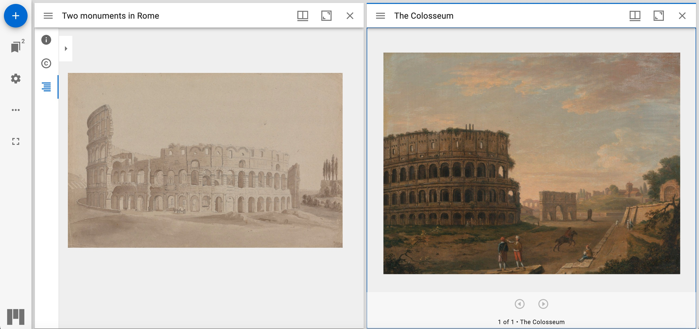

## Use Case

I want to compare pages from two different manuscripts and share a link to open both on the same view. I want to share a link to a colleague showing two similar paintings in two different collections. I want to save my current workspace (open Canvases in the current viewer) for later use. I want to open my current workspace with another viewer.



## Implementation Notes

Some viewers already implement custom formats for exporting the current workspace for sharing or later use. The Content State API could be used for the same purpose, adding the advantage of direct loading of the workspace using a crafted link with the `iiif-content` query parameter. The [multiple targets for a comparison view section](https://iiif.io/api/content-state/1.0/#53-multiple-targets-for-a-comparison-view) describes a method for targetting two Canvases at the same time; each Canvas could be from a different Manifest.

For this purpose, we create an Annotation with `motivation` set to `["contentState"]`.
The value of the `target` property of the Annotation is a list containing the `id` of the Canvases and a `partOf` property with the `id` of the Manifests they belong to.

We can hence encode the Annotation as explained in the [Content State encoding guidelines](https://iiif.io/api/content-state/1.0/#6-content-state-encoding), and then pass the encoded value, using the `iiif-content` query parameter of the viewer landing page:

```
https://example.org/viewer?iiif-content=JTdCJTIyJTQwY29udGV4dCUyMiUzQSUyMmh0dHAlM0ElMkYlMkZpaWlmLmlvJTJGYXBpJTJGcHJlc2VudGF0aW9uJTJGMyUyRmNvbnRleHQuanNvbiUyMiUyQyUyMmlkJTIyJTNBJTIyaHR0cHMlM0ElMkYlMkZwcmV2aWV3LmlpaWYuaW8lMkZjb29rYm9vayUyRjA1NDAtbGluay1mb3Itb3BlbmluZy1tdWx0aXBsZS1jYW52YXNlcyUyRnJlY2lwZSUyRjA1NDAtbGluay1mb3Itb3BlbmluZy1tdWx0aXBsZS1jYW52YXNlcyUyRmFubm90YXRpb24uanNvbiUyMiUyQyUyMnR5cGUlMjIlM0ElMjJBbm5vdGF0aW9uJTIyJTJDJTIybW90aXZhdGlvbiUyMiUzQSU1QiUyMmNvbnRlbnRTdGF0ZSUyMiU1RCUyQyUyMnRhcmdldCUyMiUzQSU1QiU3QiUyMmlkJTIyJTNBJTIyaHR0cHMlM0ElMkYlMkZpaWlmLmlvJTJGYXBpJTJGY29va2Jvb2slMkZyZWNpcGUlMkYwMzE4LW5hdlBsYWNlLW5hdkRhdGUlMkZjYW52YXMlMkYyJTIyJTJDJTIydHlwZSUyMiUzQSUyMkNhbnZhcyUyMiUyQyUyMnBhcnRPZiUyMiUzQSU1QiU3QiUyMmlkJTIyJTNBJTIyaHR0cHMlM0ElMkYlMkZpaWlmLmlvJTJGYXBpJTJGY29va2Jvb2slMkZyZWNpcGUlMkYwMzE4LW5hdlBsYWNlLW5hdkRhdGUlMkZtYW5pZmVzdC0yLmpzb24lMjIlMkMlMjJ0eXBlJTIyJTNBJTIyTWFuaWZlc3QlMjIlN0QlNUQlN0QlMkMlN0IlMjJpZCUyMiUzQSUyMmh0dHBzJTNBJTJGJTJGcHJldmlldy5paWlmLmlvJTJGY29va2Jvb2slMkYwNTQwLWxpbmstZm9yLW9wZW5pbmctbXVsdGlwbGUtY2FudmFzZXMlMkZyZWNpcGUlMkYwNTQwLWxpbmstZm9yLW9wZW5pbmctbXVsdGlwbGUtY2FudmFzZXMlMkZjYW52YXMlMkZwMiUyMiUyQyUyMnR5cGUlMjIlM0ElMjJDYW52YXMlMjIlMkMlMjJwYXJ0T2YlMjIlM0ElNUIlN0IlMjJpZCUyMiUzQSUyMmh0dHBzJTNBJTJGJTJGcHJldmlldy5paWlmLmlvJTJGY29va2Jvb2slMkYwNTQwLWxpbmstZm9yLW9wZW5pbmctbXVsdGlwbGUtY2FudmFzZXMlMkZyZWNpcGUlMkYwNTQwLWxpbmstZm9yLW9wZW5pbmctbXVsdGlwbGUtY2FudmFzZXMlMkZtYW5pZmVzdC5qc29uJTIyJTJDJTIydHlwZSUyMiUzQSUyMk1hbmlmZXN0JTIyJTdEJTVEJTdEJTVEJTdE
````

## Restrictions

The Content State API does not define how the viewer should show the two Canvases. It only mentions:

“This data structure can be used by clients to load the resource required, present a particular part of the resource to the user.” [https://iiif.io/api/content-state/1.0/#content-state](https://iiif.io/api/content-state/1.0/#content-state)

Viewers may show the Canvases side by side or decide to use different approaches (e.g. opening two browser tabs).
## Example
In this example we want to compare two paintings of the Colosseum from two different Manifests.
We can notice that the Colosseum painting of the first Manifest is in the second Canvas.

The Annotation will target the `id` of the two Canvases we want to compare and contain a reference to the two Manifests as shown in the example:





The expected result should show the two Canvases of the two Manifest depicting the Colosseum.

## Related Recipes

* [Open a specific region of a canvas in a viewer][0485] shows how open a region of interest of a Canvas.
* [Link for loading a manifest][0466] another example of Content State API.




